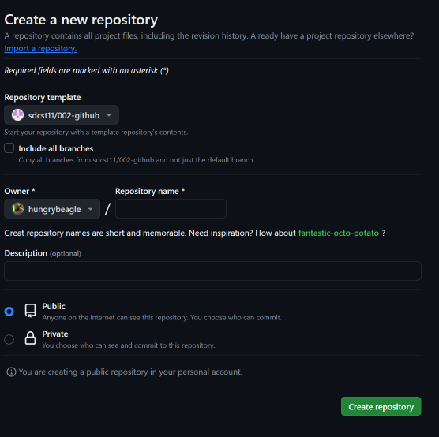

## Working with Github Repositories in the Github Site
edited version

### Objectives
* understand what a repository is on github
* clone a repository and edit the files
* use github markup language to format the README.md

## Github Repositories
A repository is the most basic element of GitHub. It's a place where you can store your code, your files, and each file's revision history. Repositories can have multiple collaborators and can be either public or private.
from:   
https://docs.github.com/en/repositories/creating-and-managing-repositories/about-repositories
Each repository usually contains one project or related group of files. For example you might be building a Flappy Bird Game. That's one repository.  You might be building a text editor. That's also one repository.  You might even be using it to keep just a bunch of recipes in text files. That could also be a repository. A repository doesn't even need to be a program; it can be just text files that you want to organize together.

## Github Files
The github page can be quite busy, but we will focus on a couple of things first.  The files are one of the most important parts of the page, because this is where you can see what is in the repository, or *repo*

***This is a graphic of a Github Repo's files shown on the main page.  ***
  
This section will also show you how many *commits* (save points) have been made in the project, as well as when each file was last updated.  You can click on the pencil icon to edit or view the file.
Clicking on one of the files will open up the file in another page, which includes a ***File Manager*** on the left side of the page.

***Github File Manager***  
  
The file manager allows you to see and access all of the files in your repo.  You can also edit all the text files using the pencil icon.  Note that you can also try to edit images, but you will get a message saying that you can not edit a binary file.  As part of today's assignment, we will be creating and editing a file using the github file manager.  At this time, take the opportunity to browse the files and see what is in them.

***The README.md file***  
   
You will notice that if you scroll down the page, there is information posted here!  This is like the contents of the title page as set by the repo owner.  You can put almost anything you want in here - pictures, text...well, that's pretty much it, but that's a whole lot more than you can do with a regular text file, which can only do text, and unformatted text at that.  This page shows the contents of the README.md file.  

The file extension .md indicates that this page is going to use Github markdown language to handle its formatting.  md files can be viewed either as Previews with all of the encodings that create formatting, or it can be viewed in **code** mode (also called RAW mode) so you can see all of the encodings and possibly edit them yourself.

Take this opportunity to view the README.md file in both preview mode and in code/raw mode.   Note that there are no pictures shown in the CODE mode, just the filenames of the pictures that are included as part of this repo.

## Github Markdown Language
A full listing of all Github markdown can be found here:   
https://github.com/adam-p/markdown-here/wiki/Markdown-Cheatsheet#images
Some of the markdown to lookup:
How do you:
* make titles
* bullet points
* italicized text
* bold text
* underlined text
* hyperlinks to other pages
* images
* line breaks

## Assignment
Create your first repository from this template.  You can do so by looking for the "Use this template" button.   
  

When you click this button, you will be presented with a page like this, where you will give your new repository its own name (if you wish) as well as where you can make it private or public. Please make it public so I can view it later.  

Now you will be adding your own file to your repo.  Look for the "+" sign near the green CODE button.  This is where you can create a new file.  We will need to name it and when we are done we will also need to Commit (save it).  
  

1. Find a selection of raw text from the Internet.  This could be a children's story (Winne the Pooh), some poetry, song lyrics, game instructions...the possibilities are endless!
2. Create a new file and call it **assignment.md** (we do you think we add the .md at the end of the file name?) and add your text to it.
3. Find some images that you would like to add to your assignment. You can also add them using the "+" sign near the green CODE button and upload them to your new repository.  Note that you will probably have to download them or save them to your desktop first.
4. Create markdown to add all of the elements we mentioned above!

#### When you are finished, find the full URL of your repo and submit it as your assignment.

### Additional Considerations
Do you use Discord?  Discord (and many similar social media apps) have their own markdown (sometimes called markup) languages that help you format your text. Visit [this page](https://support.discord.com/hc/en-us/articles/210298617-Markdown-Text-101-Chat-Formatting-Bold-Italic-Underline) for more information about Discord Markup
